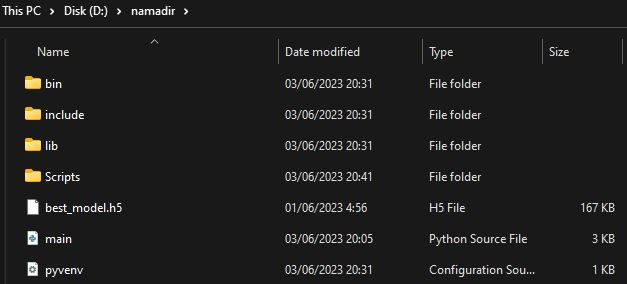

# Cara Menjalankan ML Model di Lokal (Windows)

## 1. Install Python 3.x

Unduh dan instal Python versi 3.x dari situs resmi Python atau Microsoft Store 
    
**[python.org](https://www.python.org/downloads/)**

## 2. Instal virtualenv

Buka terminal atau command prompt, kemudian jalankan perintah berikut untuk menginstal virtualenv:

        pip install virtualenv

## 3. Buat lingkungan virtual

Buka terminal atau command prompt, lalu jalankan perintah berikut untuk membuat lingkungan virtual baru dengan nama sesuai keinginan:

        python3 -m venv namadir

## 4. Aktifkan lingkungan virtual
Command untuk mengaktifkan lingkungan virtual untuk CMD atau PowerShell (Pilih salah satu saja)

- Untuk Command Prompt (CMD):

        namadir\Scripts\activate

- Untuk PowerShell:

        .\namadir\Scripts\Activate.bat

## 5. Masukkan File Model dan Script 
Setelah lingkungan virtual sudah dibuat masukkan File Main.py dan best_model.h5. Pada directory akan terlihat seperti ini:

## 6. Instalasi dependensi

Dalam lingkungan virtual yang diaktifkan, jalankan perintah berikut untuk menginstal dependensi yang diperlukan:

        pip install tensorflow keras numpy flask

## 7. Jalankan aplikasi Flask

Jalankan aplikasi Flask dengan menjalankan perintah berikut:

        python3 main.py

Dengan langkah-langkah di atas, Anda telah menyiapkan dan menjalankan aplikasi Python dengan Flask dan model machine learning. Pastikan untuk menggantikan main.py dengan nama file Python yang berisi kode aplikasi Flask Anda.

# Cara Menggunakan Model ML dengan API di Lokal (Windows)