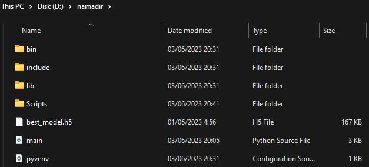

## Cara Setup Untuk Menjalankan ML Model di Lokal (Windows)

## 1. Install Python 3.x

Unduh dan instal Python versi 3.x dari situs resmi Python atau Microsoft Store. Anda dapat mengunduhnya dari 
**[python.org](https://www.python.org/downloads/)**

## 2. Instal virtualenv

Buka terminal atau command prompt, kemudian jalankan perintah berikut untuk menginstal virtualenv:

        pip install virtualenv

## 3. Buat lingkungan virtual

Buka terminal atau command prompt, pindah ke direktori tempat Anda ingin membuat lingkungan virtual, lalu jalankan perintah berikut untuk membuat lingkungan virtual baru dengan nama yang Anda inginkan:

        python3 -m venv namadir

## 4. Aktifkan lingkungan virtual

Gunakan command berikut untuk mengaktifkan lingkungan virtual di Command Prompt (CMD):

        namadir\Scripts\activate

Atau gunakan command berikut untuk mengaktifkan lingkungan virtual di PowerShell:

        .\namadir\Scripts\Activate.bat

## 5. Masukkan File Model dan Script 
Setelah lingkungan virtual aktif, letakkan file **main.py**, **best_model.h5**, dan file **CSV** untuk masing masing model ke dalam direktori yang dibuat sebelumnya. Struktur direktori akan terlihat seperti ini:

## 6. Instalasi dependensi

Dalam lingkungan virtual yang diaktifkan, jalankan perintah berikut untuk menginstal dependensi yang diperlukan:

        pip install tensorflow keras numpy flask

Perintah ini akan menginstal TensorFlow, Keras, NumPy, dan Flask.

## 7. Jalankan aplikasi Flask

Jalankan aplikasi Flask dengan menjalankan perintah berikut:

        python3 main.py

Ini akan menjalankan aplikasi Flask yang terhubung ke model machine learning Anda. Pastikan untuk mengganti Main.py dengan nama file Python yang berisi kode aplikasi Flask Anda jika nama filenya berbeda.

Setelah menjalankan perintah tersebut, Anda akan melihat output di terminal yang menunjukkan bahwa Flask sedang berjalan. Aplikasi Flask akan memulai server lokal yang dapat diakses melalui http://127.0.0.1:5000/ atau http://localhost:5000/ pada browser Anda.

Anda sekarang dapat menggunakan API untuk berinteraksi dengan model machine learning yang dijalankan secara lokal. Untuk selanjutnya akan menjalankan postman agar dapat melihat outputnya.

Pastikan untuk menghentikan aplikasi Flask dengan menekan Ctrl+C di terminal setelah selesai menggunakan aplikasi.

# Cara Menjalankan Model ML dengan Postman di Lokal (Windows)

Setelah mengikuti langkah-langkah sebelumnya dan menjalankan aplikasi Flask yang menghubungkan model machine learning, Anda dapat menggunakan Postman untuk berinteraksi dengan model tersebut melalui API yang berjalan secara lokal. Dengan mengirim permintaan melalui Postman, Anda akan dapat melihat output atau respons dari model machine learning.

Pastikan Anda telah mengaktifkan aplikasi Flask dan server lokal masih berjalan saat menggunakan Postman. Kemudian, ikuti langkah-langkah berikut untuk melihat output dari model melalui Postman:

## Instalasi Postman
1. Unduh dan instal Postman dari situs resmi Postman: https://www.postman.com/downloads/.
2. ikuti petunjuk instalasi yang disediakan oleh installer.

## Mengirim Permintaan POST dengan Postman

1. Buka Postman setelah selesai instalasi.

2. Buat tab baru dengan mengklik "+" di sebelah tab yang sudah ada.

3. Pada tab baru, pilih "POST" sebagai metode permintaan HTTP.

4. Masukkan URL endpoint API. Jika Anda menjalankan aplikasi Flask sesuai dengan langkah-langkah sebelumnya, URL yang digunakan akan menjadi http://localhost:5000/ atau http://127.0.0.1:5000/.

5. Pilih tab "Body" di bawah URL.

6. Pilih opsi "raw" dan pastikan tipe data yang dipilih adalah "JSON".

7. Masukkan data input yang sesuai dengan format yang diharapkan oleh API Anda. Pastikan data yang dimasukkan sesuai dengan definisi input yang digunakan oleh model machine learning.

8. Klik tombol "Send" untuk mengirim permintaan POST ke API.

9.  Anda akan melihat respons dari API di bagian bawah Postman. Ini akan memberikan Anda hasil yang dihasilkan oleh model machine learning berdasarkan data input yang Anda kirimkan.

Pastikan untuk menginstal Postman sesuai dengan langkah-langkah di atas. Anda juga perlu memastikan bahwa API yang dijalankan menggunakan Flask berjalan pada URL yang benar dan dapat menerima permintaan POST dengan format yang sesuai.

Selamat mencoba!